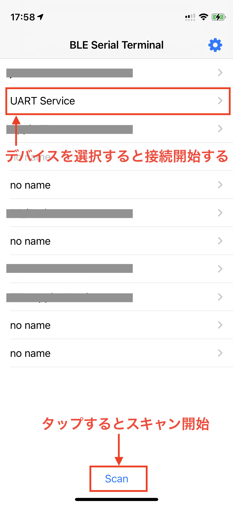
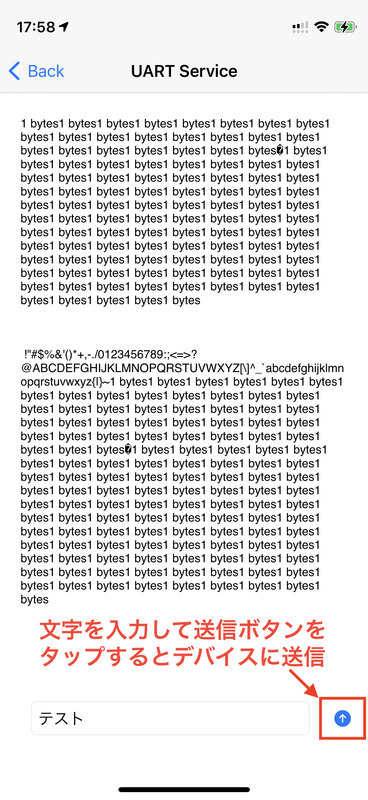

# BLEシリアルターミナルアプリ

## 概要

[ESP32サンプルコードBluetoothSerial](https://github.com/espressif/arduino-esp32/tree/master/libraries/BluetoothSerial)対応したBLE シリアルをモニターできるアプリです。

[micro:bitのBlueooth Low Energy serial UART](https://support.microbit.org/support/solutions/articles/19000062330-using-the-micro-bit-bluetooth-low-energy-uart-serial-over-bluetooth-)も動作検証していませんが動作すると思います。

## 使い方

### BLEシリアルデバイスを接続する

初期画面でScanボタンをタップすると、近くにあるBLEデバイスをリストアップします。

対象デバイス名をタップするとターミナル画面に遷移すると自動的にBLEデバイスに接続し、通信を開始します。

### BLEシリアルデバイスに文字を送信する

下部のTextFieldに文字を入力し、送信ボタン(↑)押すとBLEシリアルデバイスに文字を送信します。

## その他

アイコンは、[こちらのフリー素材](https://icon-icons.com/icon/Terminal/131942)を利用しています。

[Twitter](https://twitter.com/From_F)

